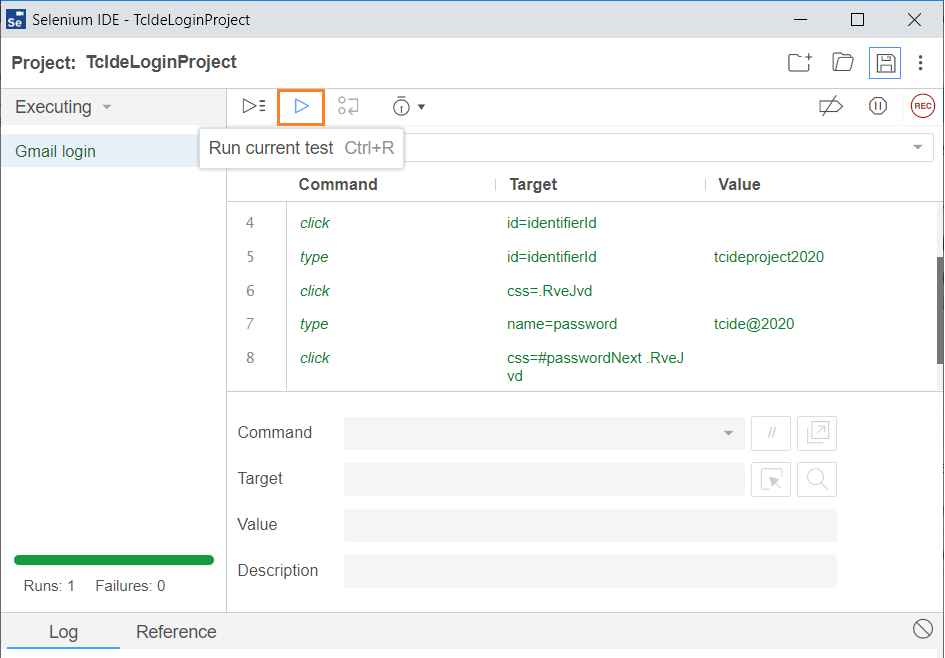

##SELENIUM IDE KOMUTLARI
Selenium IDE, web tarayıcılarında otomasyon testleri oluşturmak için kullanılan bir araçtır. Selenium IDE, kayıt ve oynat özelliği sayesinde test senaryolarınızı kolayca oluşturmanıza yardımcı olur. Selenium IDE'de işimizi kolaylaştırmak için kullanılan bazı temel komutlar:

- open: Belirtilen URL'yi açar.

- click: Belirtilen elemente tıklar.

- type: Belirtilen input alanına metin yazar.

- verifyText: Belirtilen elementin metnini doğrular.

- waitForElementPresent: Belirtilen elementin sayfada görüntülenmesini bekler.

- assert: Bir değişkenin beklenen bir değer olup olmadığını kontrol eder.

- assert title: Sayfa başlığını doğrular.

- assert text: Bir öğenin metninin sağlanan değeri içerdiğini doğrular

- store: Bir değeri bir değişken içinde saklar.

- echo: Bir metni konsola yazar.

- pause: Belirtilen süre boyunca testin durmasını sağlar (milisaniye cinsinden).

- select: Bir dropdown menüsünden bir değeri seçer.

- debugger: Yürütmeyi keser ve hata ayıklayıcıya girer

Daha fazlası için [buraya](https://www.selenium.dev/selenium-ide/docs/en/api/commands) tıklayarak göz atabilirsiniz.